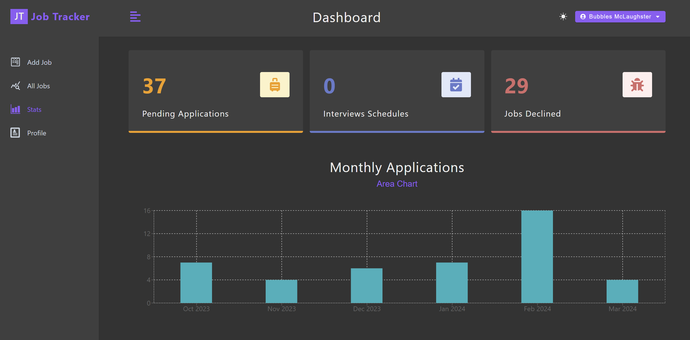

# Job Tracker

A web application where the user can register, login, and add jobs they have applied for. They can update the job status (pending, interview, declined) as the process moves foreward.

Link: https://job-tracker-1ks3.onrender.com

The application was uploaded on Render with the Free Plan. It may take a while to load as the site will be down . It will take around 1 minute to spin up.

## Tools Used

- Implemented with Javascript
- React.js for the front end
- Node.js for the back end
- Express.js to create an API for CRUD operations
- MongoDB for the database to store user credentials and job details
- Mongoose as the Object Data Modeling library for MongoDB
- JSON Web Token for Authentication
- React Query to store requests in cache to reduce the amount of requests

## Project Structure

- The front end is stored in the client directory
- Main files for front-end is in the src directory
- The back-end is stored in the root directory
- Main files for back-end are controllers, errors, middleware, models, routes, and utils

## Images

